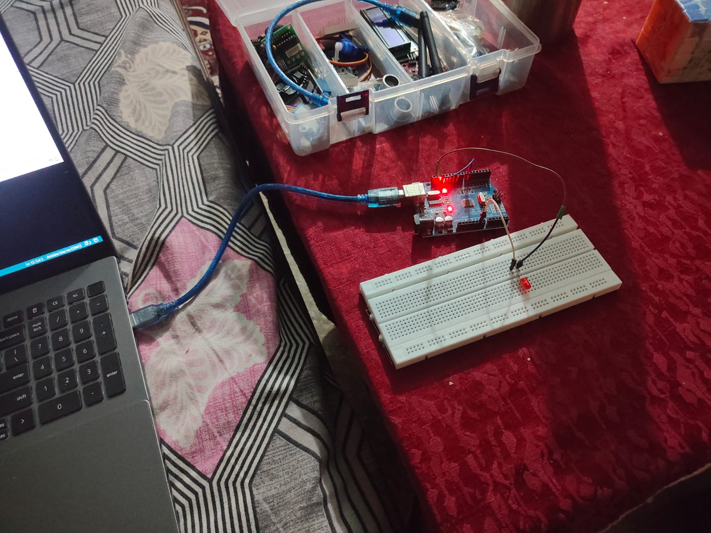
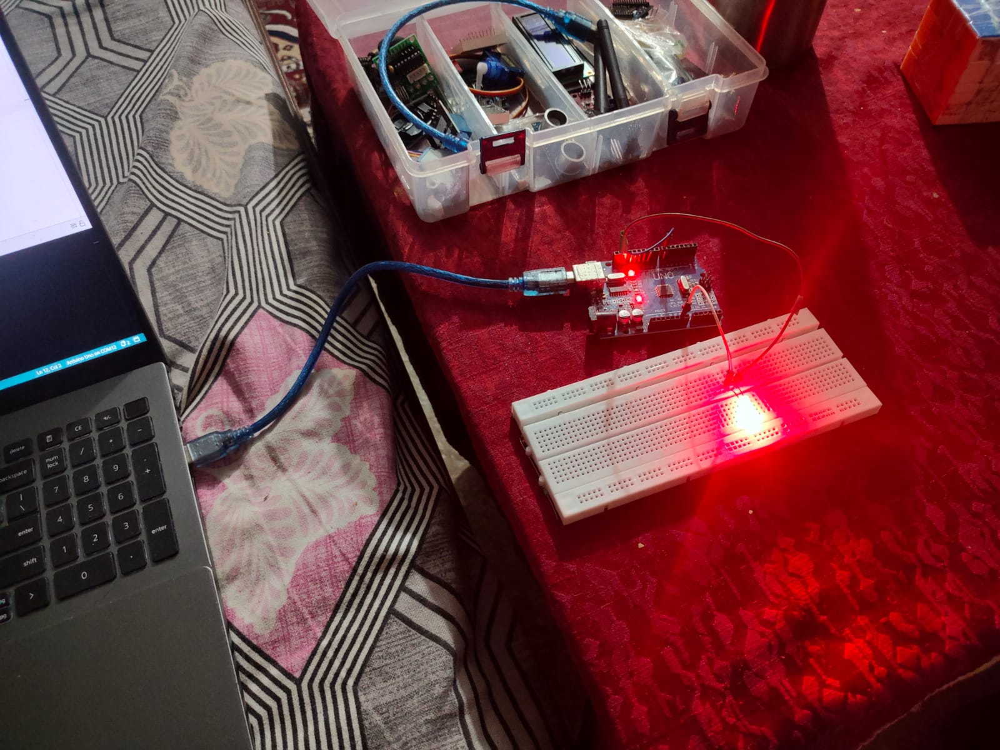
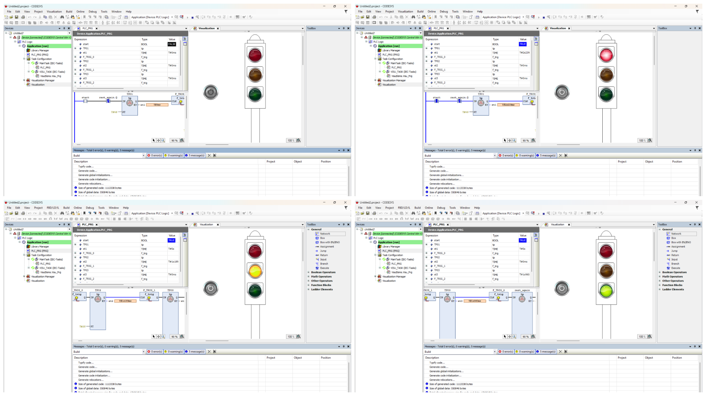

# Industrial Robotics Journey  
## Day 1 (17 Apr 2025)  

✅ **Installed CODESYS**  
✅ **Tested Arduino LED blink**  
✅ **Learned 5 German tech words:**  
   - der Sensor  
   - die Steuerung  
   - das Programm  
   - die Spannung  
   - der Roboter  

**Next Goal:** Ladder logic traffic light in CODESYS  

---

### Proof of Work  
  
  
 

## Day 2 (18 Apr 2025)
✅ Completed traffic light system in CODESYS

[Demo](TrafficLight_Demo.mp4)
## Day 3 (19 Apr 2025)
✅ Simulated conveyor belt system in CODESYS (10s cycle)
- [Demo Video](Day3/ConveyorBelt_Demo.mp4)
✅ Designed complex adjustable gripper in Siemens NX
- [Screenshots](Day3/Adjustable_Gripper_1.png) [More Views](Day3/Adjustable_Gripper_2.png)
- 
