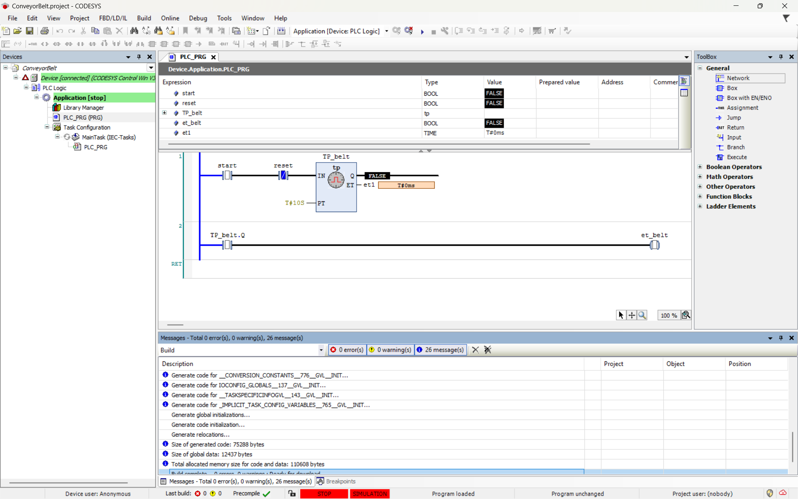

# Industrial Robotics Journey

Welcome to my learning journey in industrial robotics, automation, and design! This repository documents my progress as I develop skills in CODESYS for PLC programming, Siemens NX for CAD modeling, German language for technical contexts, and more—targeting a career in Germany’s robotics industry. Each day builds on the previous, showcasing practical projects and reflections.

## Day 1 (17 Apr 2025)

### Achievements
- ✅ **Installed CODESYS**: Set up the CODESYS IDE (Version 3.5 SP19) on a Windows environment, configured for simulation with CODESYS Control Win V3.
- ✅ **Tested Arduino LED Blink**: Wrote and uploaded a simple Arduino sketch to blink an LED, verifying hardware-software integration (Arduino Uno, 5V LED, 220Ω resistor).
- ✅ **Learned 5 German Tech Words**: Studied basic vocabulary for technical communication:
  - *der Sensor* (the sensor)
  - *die Steuerung* (the control)
  - *das Programm* (the program)
  - *die Spannung* (the voltage)
  - *der Roboter* (the robot)

### Proof of Work
- 
- 
- 

### Reflection
This day focused on foundational setup and basic hardware testing, laying the groundwork for PLC and robotics projects. The German words will aid in reading technical manuals and collaborating with German engineers.

### Next Goal
Develop a traffic light system using Ladder Diagram (LD) logic in CODESYS.

---

## Day 2 (18 Apr 2025)

### Achievements
- ✅ **Completed Traffic Light System in CODESYS**: Designed a three-phase traffic light (red, yellow, green) with a 10-second cycle using LD, simulated with CODESYS Control Win V3. Variables (`et1`, `et2`, `et3`) controlled the sequence.

### Proof of Work
- 
- 
- 

### Reflection
The traffic light project introduced me to LD programming, timer blocks (TP), and simulation debugging. Challenges included resolving runtime connection errors, overcome by restarting the CODESYS runtime.

### Next Goal
Simulate a conveyor belt system and design a gripper in Siemens NX.

---

## Day 3 (19 Apr 2025)

### Achievements
- ✅ **Simulated Conveyor Belt System in CODESYS (10s cycle)**: Implemented a conveyor belt with a 10-second cycle using a pulse timer (TP_belt) and output variable (et_belt:BOOL). The system activates for 10 seconds when `start` is TRUE, with `reset` to stop. Added `et1:TIME` for elapsed time tracking (optional).
- ✅ **Designed Complex Adjustable Gripper in Siemens NX**: Created a multi-featured gripper with a 60mm x 30mm x 15mm base, a 10mm central pivot hole, and a 20mm x 30mm x 5mm angled finger. Used multi-plane sketches (XY, XZ), extrusions, cuts, and 3mm fillets. The design supports adjustability with potential slot or pivot mechanisms.

### Proof of Work
- 
- 
- 
- [ConveyorBelt2](day3/ConveyorBelt_Demo_2.png)
- [ConveyorBelt3](day3/ConveyorBelt_Demo_3.png)
- [ConveyorBelt4](day3/ConveyorBelt_Demo_4.png)
- [ConveyorBelt5](day3/ConveyorBelt_Demo_5.png)

### Reflection
The conveyor belt simulation built on LD skills, with the 10-second cycle reflecting a deliberate design choice over the initial 5-second plan. The NX gripper challenged me with multi-plane modeling, leveraging Fusion 360 experience to innovate an adjustable structure. Future improvements could include dynamic assembly constraints.

### Next Goal
Enhance German technical vocabulary and explore KUKA.Sim for robotic simulation.

---

## Skills Developed
- **PLC Programming**: Ladder Diagram in CODESYS for sequential control.
- **CAD Modeling**: Siemens NX for 3D design, including sketches, extrusions, and fillets.
- **German Language**: Basic tech terms for industry communication.
- **Version Control**: Git and GitHub for project documentation.

## Future Plans
- Integrate CODESYS with NX designs for end-to-end automation workflows.
- Expand German to intermediate level for technical interviews.
- Simulate robotic arms in KUKA.Sim by Day 7.

## Contact
Feel free to connect or collaborate! Find me on [LinkedIn](https://www.linkedin.com/in/md-hamza-malik-368643256/) or reach out via email (hamzamalik9311@gmail.com).
